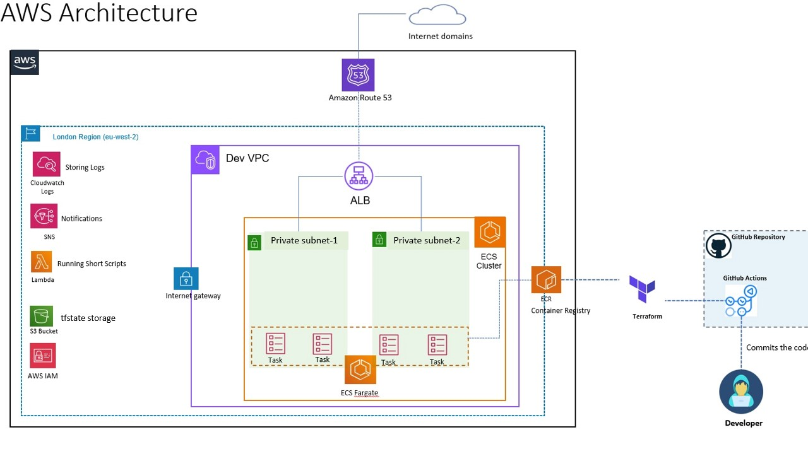

# mdgwebapp
A simple todo-list app built with django.

### Setup
Clone this repo
```bash
git clone hhttps://github.com/jjparh/mdgwebapp.git
```
Install django and go to the cloned repo directory and run the following command

```bash
python manage.py makemigrations
```

This will create all the migrations file (database migrations) required to run this App.

Now, to apply this migrations run the following command
```bash
python manage.py migrate
```

We need to create an admin user to run this App. On the terminal, type the following command and provide username, password and email for the admin user
```bash
python manage.py createsuperuser
```

Start the server by following command

```bash
python manage.py runserver
```

Once the server is hosted, head over to http://127.0.0.1:8000/todos/ for the App.


###### AWS Deployment Diagram ######


###### APP Workflow #####

ECS-with-Terraform
Tasks:

Deploy a Django Application on AWS ECS Fargate Using Terraform.

The ECS Fargate should be deployed on Private Subenet.
Image should be read from ECR.
Create a GitHub workflow to run Terraform code.

List of created resources

VPC:
Public Subnets
Private Subnets
Internet Gateway
NAT Gateway
Route Tables
Security Groups

IAM Role

Application Load Balancer

Elastic Container Registry

ECS Cluster
ECS Service
ECS tasks
